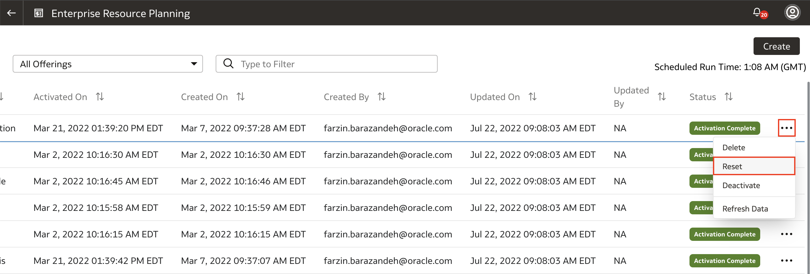

# How do I reset a data pipeline for a functional area in Fusion Analytics Warehouse (FAW)?
Duration: 1 minutes

You might want to reset your data pipeline if you change your Fusion Application source and want to perform a full load of the data from the new source. Another reason may be if you want to fix data inconsistencies due to deletes which incremental update would not fix. Resetting the data pipeline would be an appropriate solution for these scenarios.

## Reset a data pipeline
>**Note:** You must have the **Service Administrator** application role to successfully complete this Sprint.

1. Using the **Navigation** menu in  your FAW homepage, click **Console**.

  

2. Under **Application Administration**, click **Data Configuration**.

  

3. Under **Applications**, select the application that has the functional area that you want to reset the data for. For this example, we'll select **Enterprise Resource Planning**.

  

4. Click the **Action** menu of the Functional Area you want to reset the data pipeline for and click **Reset**.

  

5. A dialogue box will appear warning you that resetting the data pipeline will reload the data. Heed this warning and click **Reset**.

  

6. The status for the functional area we just reset the data for will change to **Reset Scheduled**.

  

7. Once the reset is complete, the status will update to **Reset Completed**.

## Learn More

* [Reset a Data Pipeline for a Functional Area](https://docs.oracle.com/en/cloud/saas/analytics/22r3/fawag/reset-data-pipeline-functional-area.html)

## Acknowledgements
* **Author** - Nagwang Gyamtso, Product Manager, Analytics Product Strategy
* **Last Updated By/Date** - Nagwang Gyamtso,  September 2022
