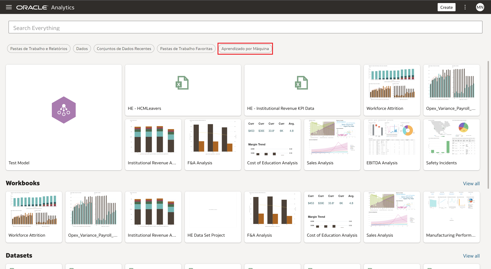
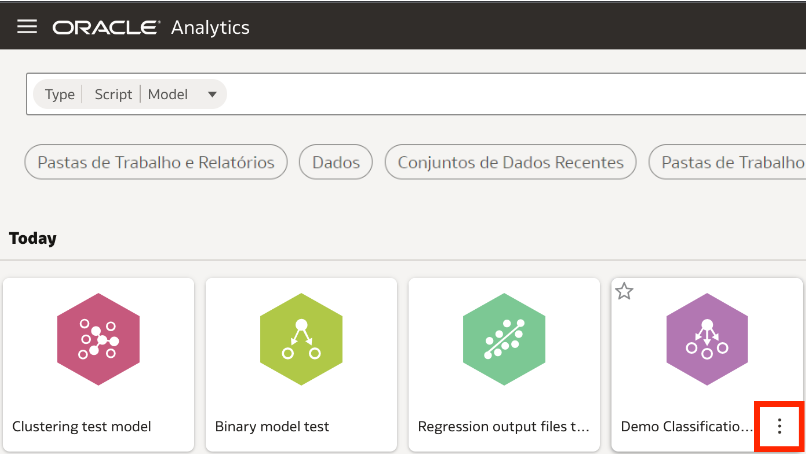
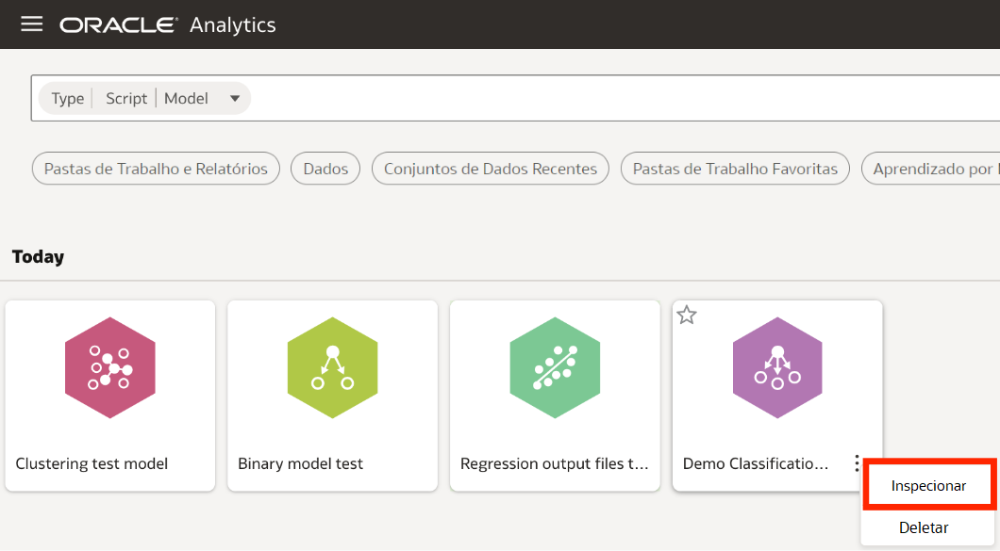
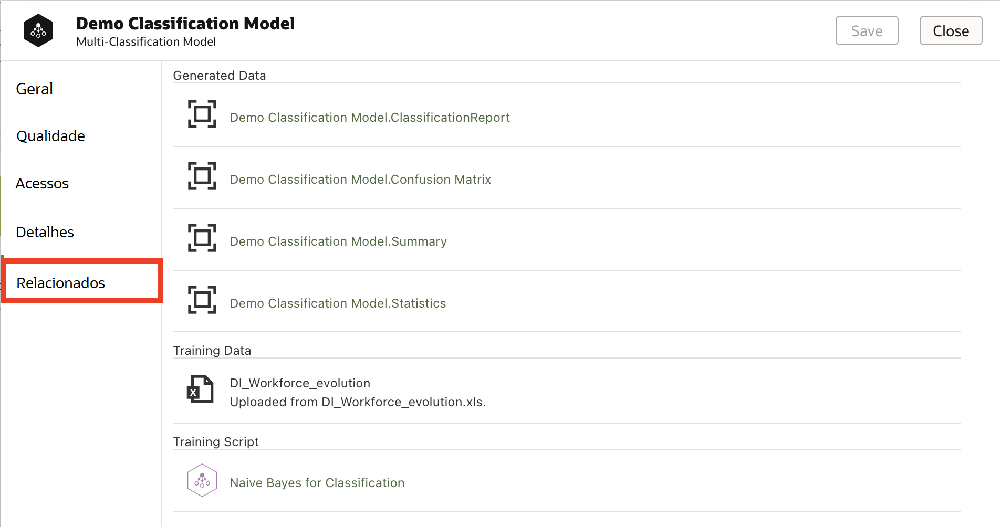
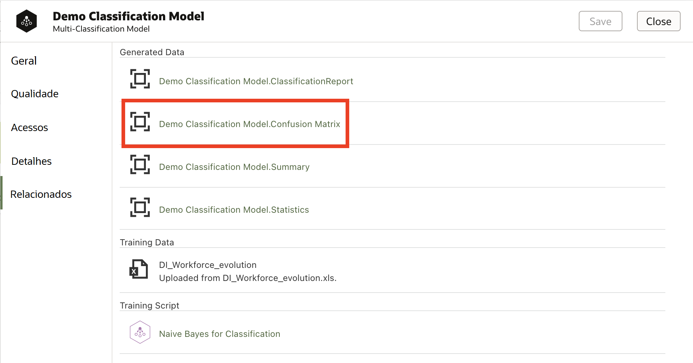

# Como posso verificar a precisão de um modelo de machine learning no Oracle Analytics Cloud (OAC)?
Duração: 2 minutos

Oracle Analytics Cloud lhe dá a capacidade de não apenas criar facilmente modelos de machine learning, mas também avaliar sua precisão. Você pode visualizar uma exibição pré-criada de métricas de precisão, ou acessar conjuntos de dados e criar suas próprias visualizações para entender a qualidade do modelo.

É fundamental garantir a qualidade de um modelo de machine learning antes de colocá-lo em uso. 
Os passos seguintes lhe mostrarão como avaliar rápida e efetivamente a precisão de seu modelo no Oracle Analytics Cloud.

## Verifique a precisão de um modelo de machine learning

Primeiro você deve ter treinado um modelo de aprendizagem de máquina no Oracle Analytics Cloud para completar os seguintes passos. Para acessar um guia sobre criação de modelos, [clique aqui.](https://apexapps.oracle.com/pls/apex/r/dbpm/livelabs/run-workshop?p210_wid=3281&session=107730485068362)
>**Nota:** Você deve ter o cargo **DV Content Author** para executar as seguintes etapas.

1. A partir da página inicial do OAC, clique em **Aprendizado por Máquina** e encontre o modelo treinado cuja precisão você gostaria de verificar.

    

2. Passe o mouse sobre o modelo e clique sobre os três pontos que aparecem no canto inferior direito.

    

3. Clique na opção **Inspecionar**

    

4. Selecione a aba **Qualidade** para visualizar as métricas básicas de precisão para seu modelo. As métricas que aparecem dependem do tipo de modelo. Para modelos Binários e  Classificação Múltipla, uma matriz de confusão, bem como uma série de métricas de precisão são mostradas. Para modelos de previsão numérica, um gráfico de valores residuais e uma série de métricas de precisão são mostrados.

      >**Nota:** Para modelos de agrupamento, nenhuma informação aparece nesta tela. Continue no próximo passo para aprender como acessar dados de precisão para modelos de clustering.

      

5. Para obter insights além do que é exibido aqui, clique em **Relacionados**. Sob esta aba encontramos objetos relacionados ao nosso modelo, como os dados de treinamento, e scripts para treinamento e pontuação do modelo. Também encontramos conjuntos de dados que são gerados quando o modelo é treinado e que nos ajudam a avaliar a precisão do modelo. Alguns destes dados podem ter sido exibidos na página **Qualidade**, enquanto outros podem permanecer sem uso.

    

6. Clique em qualquer conjunto de dados que você gostaria de usar para avaliar a qualidade do modelo a fim de abrir uma pasta de trabalho usando esse conjunto de dados.

      >**NOTA:** Criar uma pasta de trabalho com os conjuntos de dados gerados a partir de modelos de clustering é a única maneira de avaliar sua precisão.

      

7. Agora podemos visualizar os dados da maneira que quisermos para avaliar a precisão do modelo. Por exemplo, exibimos um gráfico de barras comparando a precisão, recall e pontuação F1 para as diferentes saídas de classificação possíveis.

    

Parabéns! Você acabou de aprender como verificar a precisão de um modelo de machine learning no Oracle Analytics Cloud!

## Saiba mais

* [Inspecione e mude um modelo preditivo](https://docs.oracle.com/en/cloud/paas/analytics-cloud/tutorial-inspect-modify-prediction-model/index.html)
* [O que é um dataset relacionado com um modelo preditivo?](https://docs.oracle.com/en/cloud/paas/analytics-cloud/acubi/create-and-use-oracle-analytics-predictive-models.html#GUID-4C55DF0E-7FBB-40B7-8650-71CCCA574F57)

## Reconhecimentos
* **Autor** - Miles Novotny, Solution Engineer, North America Specialist Hub
* **Tradução** - Isabelle Dias, GenO, Brazil Data & AI Team
* **Última Atualização** - Isabelle Dias,  Novembro 2022
