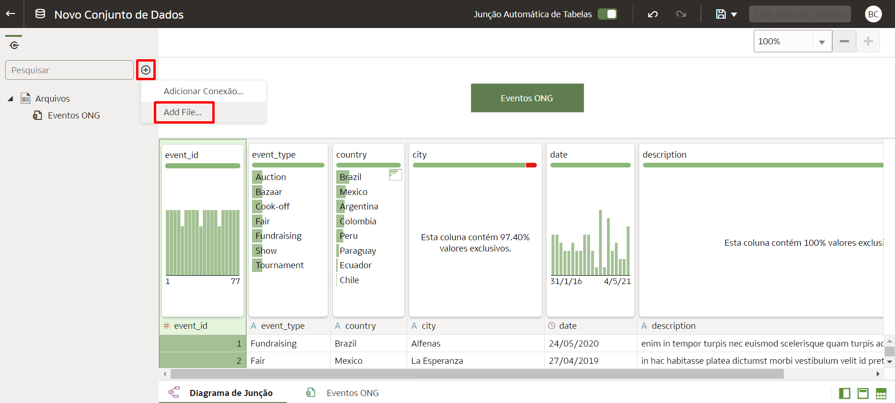
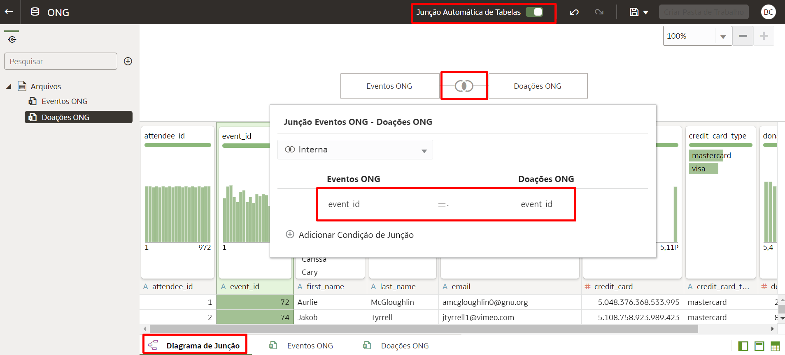

# Como realizar um join entre duas tabelas em um conjunto de dados no Oracle Analytics Cloud (OAC)?

Duração: 3 minutos

O Oracle Analytics Cloud permite a realização de Joins entre várias tabelas em um conjunto de dados através de suas robustas capacidades de preparação de dados. Quando você arrasta uma tabela e a solta em um conjunto de dados, o OAC automaticamente cria Joins entre as tabelas se houver nomes de colunas iguais. Mesmo se os nomes não forem iguais, pode-se criar facilmente um Inner, Left, Right ou Full Outer Join. Esse sprint te guiará em como construir esses relacionamentos!

## Criar Joins
>**Nota:** É mandatório possuir a Atribuição do Aplicativo (Application Role) **DV Content Author** para executar esse sprint com sucesso.

1. A partir da **Página Inicial** do seu OAC, crie um conjunto de dados clicando em **Criar** e selecionando **Conjunto de Dados**.

    

2. Selecione o arquivo de dados a partir do qual você deseja criar um conjunto de dados. Ele pode vir da sua máquina local, de uma área de assunto ou de uma conexão. Se é da sua máquina local, selecione o arquivo e clique em **Abrir**

    

3. Isso carregará o conjunto de dados e permitirá que você mude o Nome e a Descrição do seu arquivo se necessário. Clique em **OK**.

    

4. Adicione outro arquivo clicando no **+** e selecionando **Add File**. Uma vez que seu arquivo foi carregado, você terá novamente a opção de mudar seu nome e descrição. Após as mudanças, selecione **OK** para adicionar o arquivo ao seu conjunto de dados.

    

5. Com seu conjunto de dados adicionado, você perceberá que as duas tabelas são unidas automaticamente através de um Join. Isso acontece quando o Oracle Analytics identifica que os nomes de duas colunas são exatamente iguais.

    >**Nota:** O Auto Join também funciona em mais de duas tabelas.
    
    <!-- -->

    >**Nota 2:** Se o Auto Join não acontecer, valide se as suas colunas usadas como chave não estão sendo tratadas como **Métricas**. Para que o Join aconteça, elas precisam ser tratadas como **Atributos** pelo OAC.

    

6. Se o Auto Join está habilitado e o Oracle Analytics não encontrou nomes correspondentes entre as colunas, você pode **clicar com o botão direito** em uma das tabelas e selecionar **Juntar a**, e logo após indicar a tabela com a qual você deseja fazer o Join.

    >**Nota:** Você também pode arrastar uma tabela para cima da outra para criar um Join entre elas.

    

7. Selecione os nomes das colunas que você quer utilizar para fazer o Join das duas tabelas. Você pode fortalecer seu join se você tiver múltiplas colunas relacionadas clicando em **Add Join Condition** e selecionando essas colunas extra.

    

8. Uma vez criados os seus Joins, clique em **Salvar** e depois em **OK**. Não se esqueça de dar um nome ao seu conjunto de dados.

    

Parabéns! Você aprendeu como criar Joins entre duas tabelas em um conjunto de dados no Oracle Analytics Cloud!

## Saiba Mais

* [Add Joins Between Dataset Tables](https://docs.oracle.com/en/cloud/paas/analytics-cloud/acubi/add-joins-dataset-tables.html)

* [Understand Dataset Table Joins](https://docs.oracle.com/en/cloud/paas/analytics-cloud/acubi/understand-dataset-table-joins.html)

## Reconhecimentos
* **Autor** - Nagwang Gyamtso, Product Manager, Product Strategy
* **Tradução** - Breno Comin, Cloud Solution Engineer, Brazil Data & AI Team
* **Última Atualização** - Thais Henrique,  Março 2023
