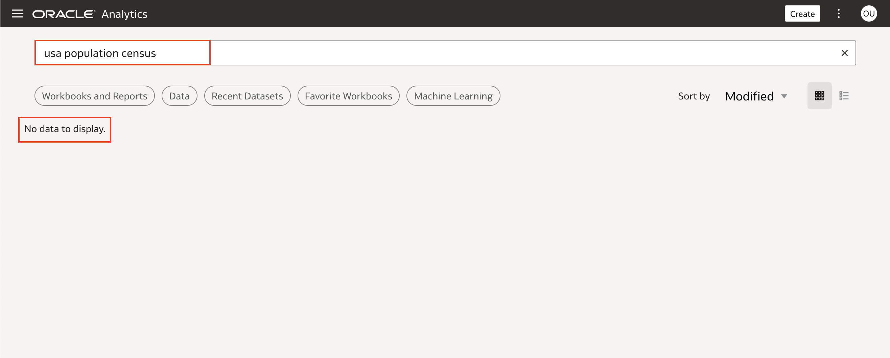
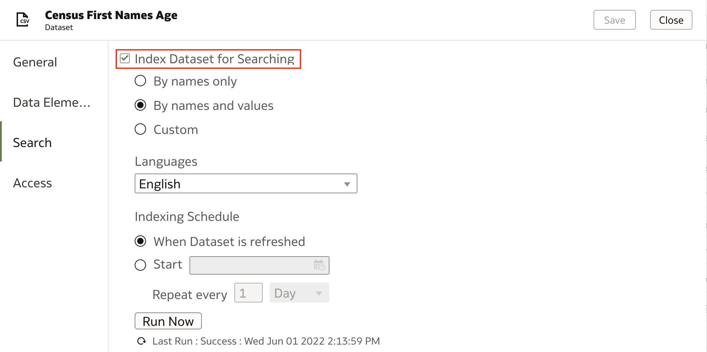
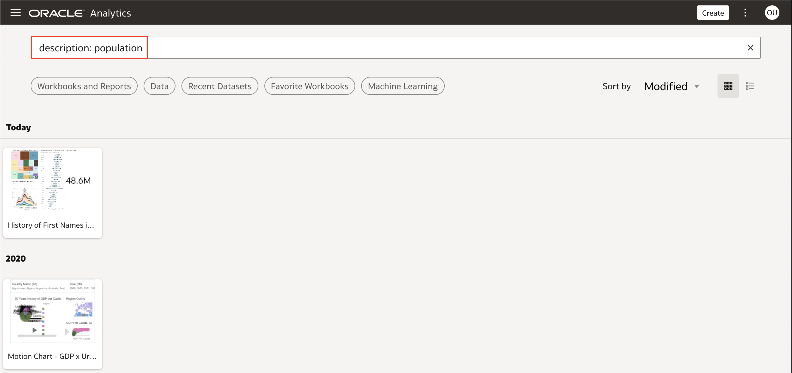

# Como pesquisar um workbook pela descrição no  Oracle Analytics Cloud (OAC)?

Duração: 1 minuto

Pesquisas em Oracle Analytics lhe permite encontrar conteúdos sejam eles pastas de trabalho (workbooks), objetos salvos ou colunas de conjunto de dados (datasets) diretamente da página inicial. Se você deseja restringir sua pesquisa, pesquisar a descrição de uma pasta de trabalho é uma maneira de encontrar a pasta de trabalho exata que você está procurando. Existem muitos recursos avançados de pesquisa para localizar os objetos exatos que você deseja encontrar, incluindo a pesquisa de nome, proprietário, colunas ou combinação de vários termos de pesquisa.

### **Cenário:**
Você deseja restringir sua pesquisa usando uma descrição de uma pasta de trabalho, mas não está vendo nenhum resultado.

Essa sprint irá te guiar a utilizar buscas avançadas para buscar workbooks por sua descrição.

## Buscando workbooks pela descrição
>**Nota:** Você deve ter o cargo **BI Content Author** para executar os próximos passos.

1. Tenha certeza que os datasets usados em seu workbook foram indexados para buscas. Se isso não foi feito, confira a sprint **Como posso pesquisar meu conjunto de dados no Oracle Analytics Cloud (OAC)?** e habilite a indexação para os datasets utilizados no workbook que você deseja buscar.

    

2. Após seus dataset estar habilitado para indexação, volte para a página inicial do OAC e escreva *description:* na barra de busca, seguido do termo que você deseja procurar. Por exemplo, *description: population* resulta em todos os workbooks com a palavra "population" em sua descrição.

    

3. Recebendo múltiplos resultados, você consegue refinar sua busca com mais termos, incluindo *and* entre dois termos. Por exemplo, se você quer buscar 'population census', o ideal é buscar '*description: population and description: census*'. Isso resultará em workbooks contendo as palavras population e census.

    >**Nota:** Você pode usar *description:* ou *desc:*. ambos irão buscar a descrição do workbook.

    

Parabéns! Você acaba de aprender a explorar as possibilidades das buscas avançadas para pesquisar a descrição de um workbook!

## Saiba mais

* [Encontre Dados, Workbooks, e Visualizações](https://docs.oracle.com/en/middleware/bi/analytics-desktop/bidvd/find-data-workbooks-and-visualizations.html#GUID-DA77E10C-0796-4578-9761-D2AFC75F7B8D)

## Acknowledgements
* **Author** - Nagwang Gyamtso, Product Manager, Product Strategy
* **Tradução** - Isabel Giannecchini, Cloud Engineer GenO, Brazil Data & AI Team
* **Última Atualização** - Thais Henrique,  Março 2023