# How do I control user access in Query Service?

Duration: 10 minutes

## Introduction

Oracle Cloud Infrastructure (OCI) Identity and Access Management (IAM) Service lets you control who has access to your cloud resources. You control the types of access a group of users has and to which specific resources. In this sprint, you will create two users and two groups: An administrator group and an end user group. You will then add each user to the appropriate group and grant each group specific privileges to resources in Query Service.

A user’s permissions to access services comes from the groups to which they belong. The permissions for a group are defined by policies. Policies define what actions members of a group can perform, and in which compartments. Users can access services and perform operations based on the policies set for the groups of which they are members.

### Prerequisites

* An Oracle Cloud Administrator Account.
* The required permissions to create dynamic groups
* The required permissions to create policies in the root compartment

## Create an Administrator IAM User

A Cloud Administrator has complete control over all of the resources in the tenancy; however, it's a good practice to delegate administration tasks to one or more Query Service administrators. To create a new Query Service IAM administrator user, a Cloud Administrator must create a user and then add that user to a Query Service administrators group. You create Identity and Access Management (IAM) groups with access privileges that are appropriate to your needs.

In this section, you will create a new IAM administrator user that you will add to the Query Service **admin** group that will create in another section of this sprint. This group will have full permissions to manage all the resources in Query Service such as create projects, create worksheets, create tables, and submit queries in the selected training-query-service compartment.

1. Sign in to the Oracle Cloud Infrastructure Console as the Cloud Administrator using your tenancy, username, and password. The **Console** Home page is displayed. Open the **Navigation** menu and click **Identity & Security**. Under **Identity**, click **Users**.

2. On the **Users** page, click **Create User**.

   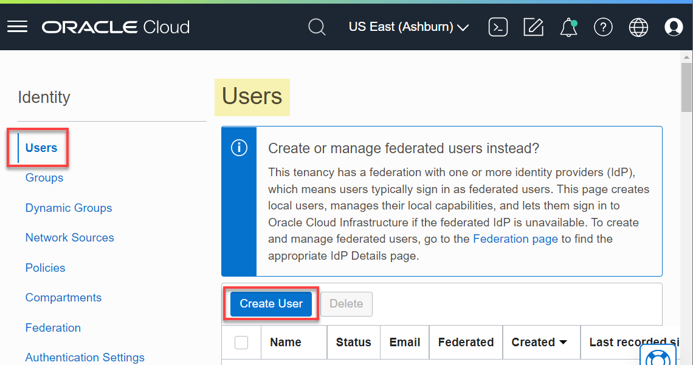

3. In the **Create IDCS User** page, specify the following details about the new **admin** user:
    * **Select User Type:** Click the **IAM User** box. The title of the page changes to **Create IAM User**.
    * **Name:** Enter **`training-qs-admin-1`**.
    * **Description:** Enter **`Training Query Service Administrator 1`**.
    * **Create Another User:** Leave this checkbox unchecked.

      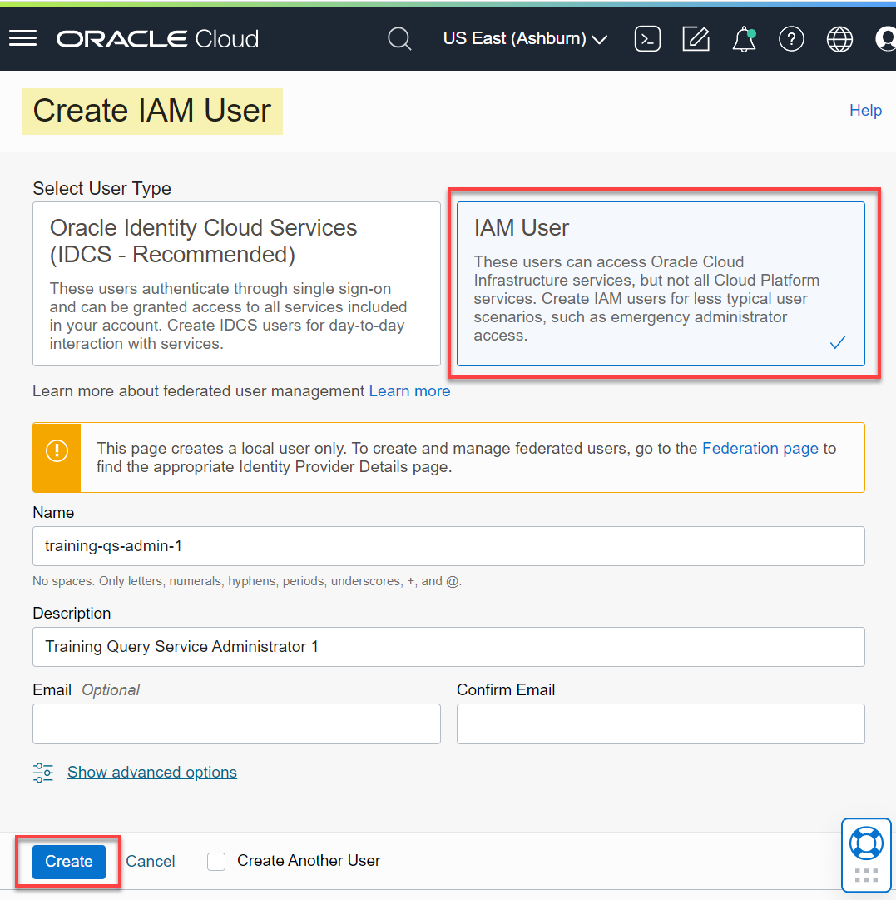

4. Click **Create**. A success message is displayed with a **View Details** link that you can click to access the User Details page. Don't click the link. The admin user is created and the **User Details** page for the new **`training-qs-admin-1`** user is displayed.

     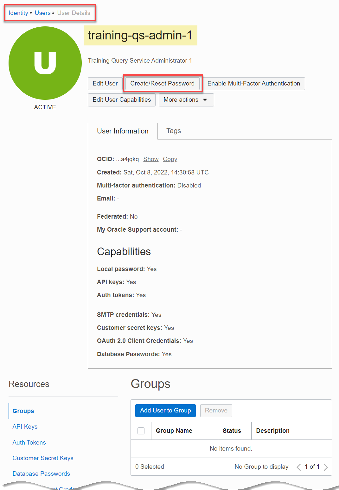

**Set the temporary password for the `training-qs-admin-1` user.**

5. On the **training-qs-admin-1** page, click **Create/Reset Password**. The **Create/Reset Password** message box is displayed with the message **This will create a new one-time** password for this user. The user must change the password the first time on the first sign in to this account. Click **Create/Reset Password**.

6. On the **Create/Reset Password** dialog box, in the **New Password** section, click the **Copy** link to copy the analyst user temporary password and save it in a safe place such as an editor file of your choice. The link changes briefly to **Copied**, and then back to **Copy**. This password will not be shown again. You can also click the **Show** link to show the password. Next, click **Close**.

    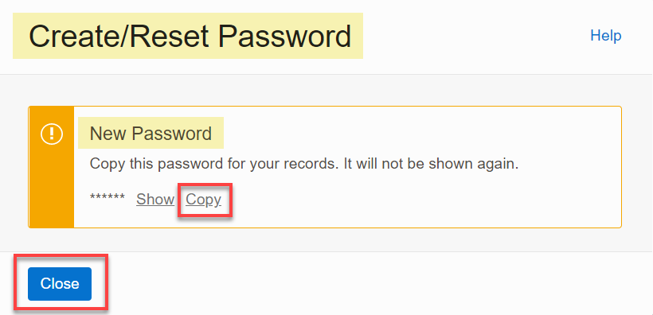

**Sign in to Console as the newly created `training-qs-admin-1` user.**

 7. Sign in to the **Console** as the newly created `training-qs-admin-1` IAM user in a _different web browser or in an incognito window in your current web browser_. This ensures that you don't get logged out of the Oracle Cloud Infrastructure user that you still need to create the second IAM analyst user.

 8. Go to [cloud.oracle.com](https://cloud.oracle.com/). In our example, we used Mozilla Firefox to login as the new admin user.

    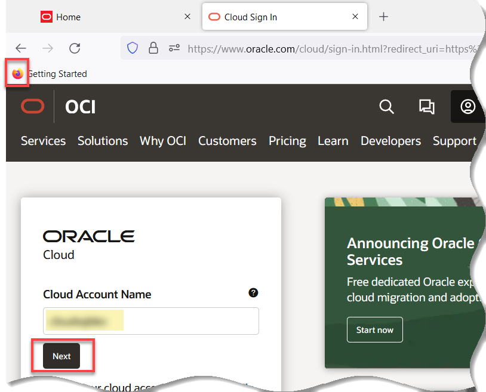

 9. Enter your tenancy name in the **Cloud Account Name** field, and then click **Next**.

 10. On the **Sign In** page, click the down arrow next to the **Oracle Cloud Infrastructure Direct Sign-In** section to expand it. Enter the admin username and temporary password, and then click **Sign In**. The admin user credentials are provided to that user by the Cloud Administrator who created this account.

    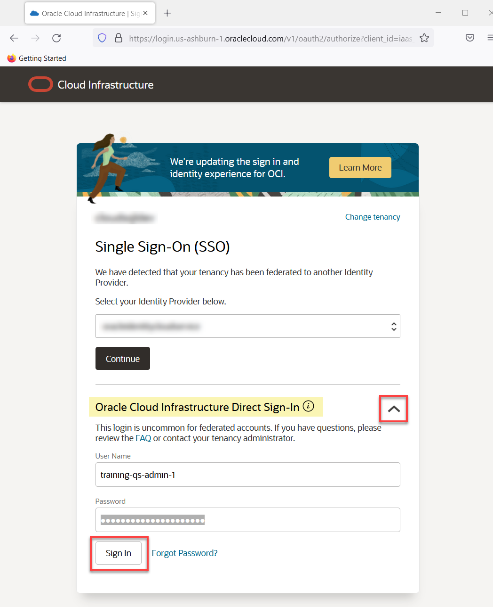

11. The **Change Password** dialog box is displayed. Since this is the first time you are signing in as the admin user, you’ll be prompted to change your temporary password. Enter the temporary password in the **Current Password** field. Enter a new password in the **New Password** and **Confirm New Password** fields, and then click **Save New Password**.

    

12. _You are now logged in to the **Console** as the new admin user, **`training-qs-admin-1`**!_

    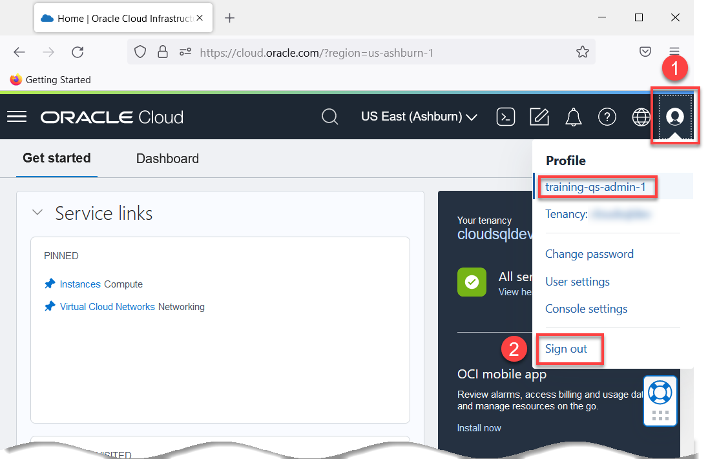

13. Logout of the admin account. From the **Profile** icon in the banner, click **Sign out**. Don't close the web browser window because you will still use it to test logging in to the other user that you will create in the next step.

## Create an Analyst IAM User

Create a new analyst user that you will add to the **analysts** group that you will create in another section of this sprint. Switch back to your first web browser where you are logged in as an Oracle Cloud Administrator.

>**Note:** If your session has timed out, log back in to the Oracle Cloud Infrastructure account.

 1. In the **Create IAM User** page, specify the following details about the new **analyst** user:
     * **Select User Type:** Accept the currently selected **IAM User** box.
     * **Name:** Enter **`training-qs-analyst-1`**.
     * **Description:** Enter **`Training Query Service Analyst 1`**.
     * **Create Another User:** Leave this checkbox unchecked.

       

 2. The analyst user is created and the **User Details** page for the new **`training-qs-analyst-1`** user is displayed.

    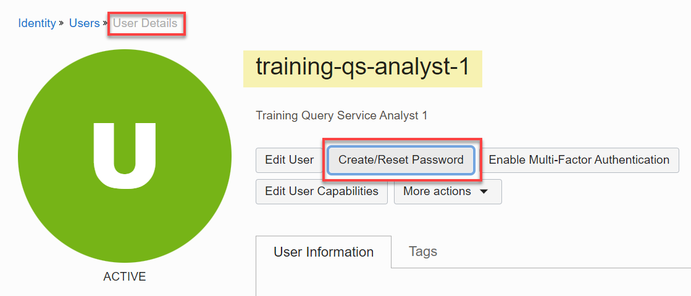

**Set a temporary password for the new analyst user.**

3. On the **training-qs-analyst-1** page, click **Create/Reset Password**. The **Create/Reset Password** message box is displayed. Click **Create/Reset Password**.

4. On the **Create/Reset Password** dialog box, in the **New Password** section, click the **Copy** link to copy the analyst user temporary password and save it in a safe place such as an editor file of your choice. The link changes briefly to **Copied**, and then back to **Copy**. This password will not be shown again. You can also click the **Show** link to show the password. Next, click **Close**.

5. Switch back to your second web browser window to test logging in as the new analyst user.

**Sign in to Console as the newly created `training-qs-analyst-1` IAM user in a new web browser window.**

6. In our example, we will use Mozilla Firefox to log in to the new analyst user. Navigate to [cloud.oracle.com](cloud.oracle.com).

7. Enter your tenancy name in the **Cloud Account Name** field, and then click **Next**.

8. On the Sign in page, click the down arrow next to the **Oracle Cloud Infrastructure Direct Sign-In** section.

9. In the **Oracle Cloud Infrastructure Direct Sign-In** section, enter the analyst username and temporary password, and then click **Sign In**.

    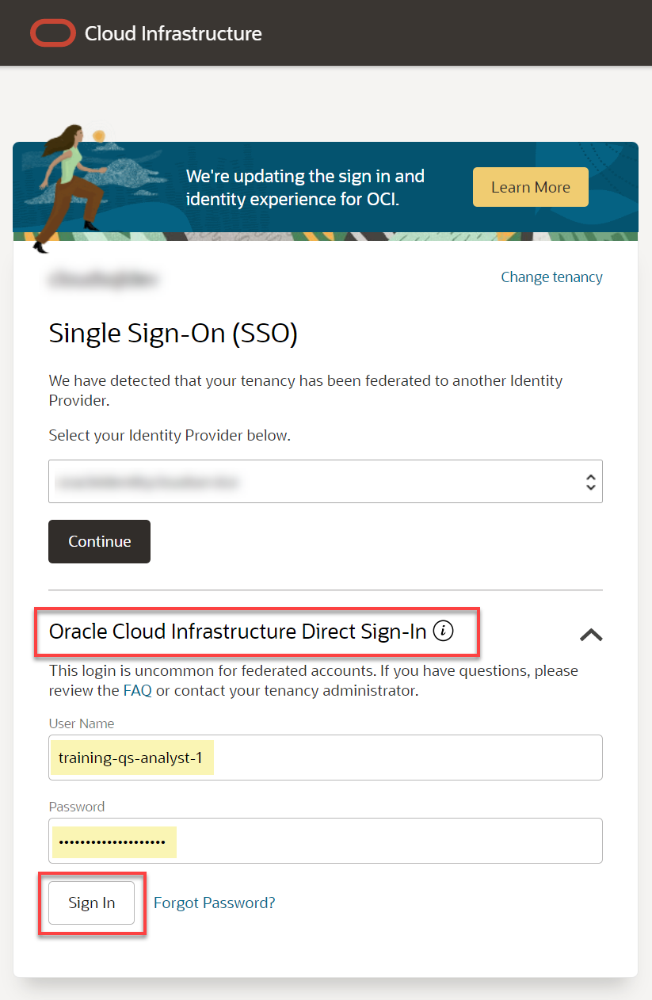

>**Note:** The new analyst user credentials are provided to that user by the Cloud Administrator who created this account.

10. The **Change Password** dialog box is displayed. Since this is the first time you are signing in as the analyst user, you’ll be prompted to change the temporary password. Enter the temporary password in the **Current Password** field. Enter a new password in the **New Password** and **Confirm New Password** fields, and then click **Save New Password**.

11. _You are logged in to the **Console** as the new analyst user, **`training-qs-analyst-1`**!_

    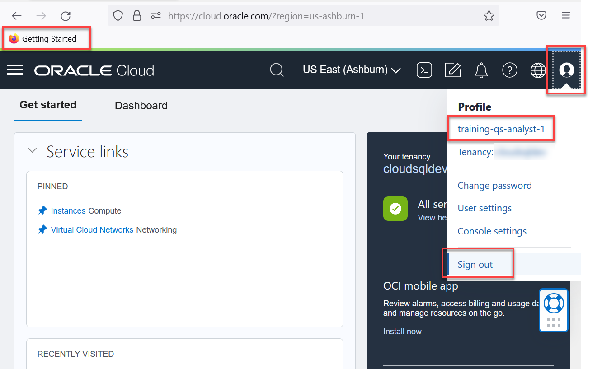

12. Logout of your analyst account. From the **Profile** icon in the banner, click **Sign out**.

## Create Query Service Groups and Add Users to the Appropriate Groups

You will create an Administrator group and then add the newly created admin user to this group. Next, you will create an analyst group and then add the newly created analyst user to this group.

### **Create a Query Service Administrator group whose members will be granted full permissions to manage Query Service.**

1. Sign in to the Oracle Cloud Infrastructure Console as the Cloud Administrator using your tenancy, username, and password. The **Console** Home page is displayed. Open the **Navigation** menu and click **Identity & Security**. Under **Identity**, click **Groups**.

2. In the **Create Group** dialog box, specify the following details about the new admin group:
     * **Name:** Enter **`training-qs-admin-group`**.
     * **Description:** Enter **`Training Query Service Admin. Group`**.
     * **Create Another Group:** Select this checkbox.

     

3. Click **Create**. If the group is created successfully, a confirmation message is displayed briefly with a **View Details** link. The **Create Group** page is re-displayed.

### **Create a Query Service Analyst group whose members will be granted specific permissions to Query Service resources.**

4. In the **Create Group** dialog box, specify the following details about the new analyst group:
     * **Name:** Enter **`training-qs-analyst-group`**.
     * **Description:** Enter **`Training Query Service analyst Group`**.
     * **Create Another Group:** De-select this checkbox.

     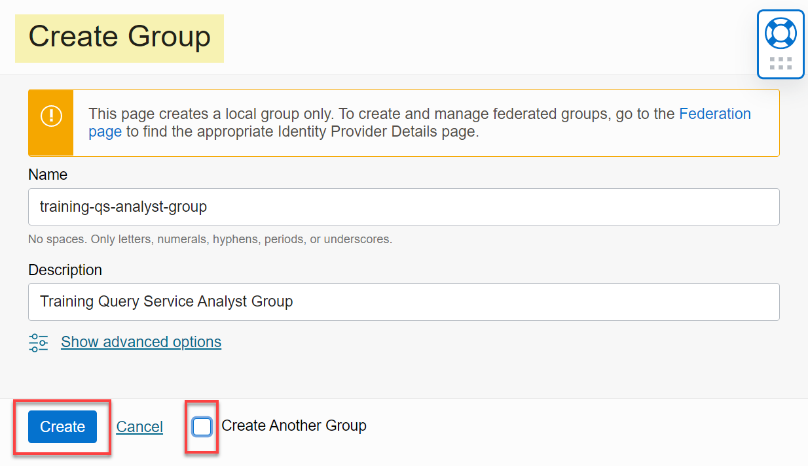

5. Click **Create**. If the group is created successfully, a conformation message is displayed briefly with a **View Details** link. The **Group Details** page for the new **training-qs-analyst-group** is displayed.

      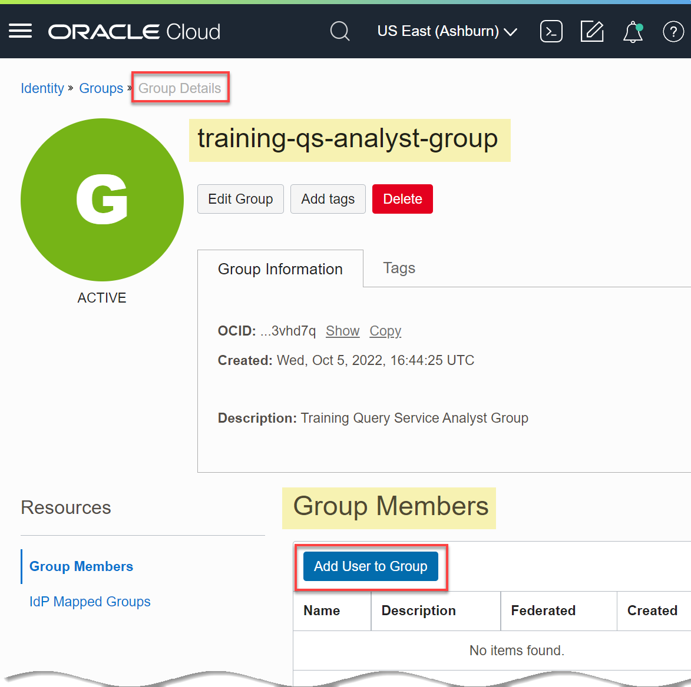

### **Add the analyst user to the analyst group**

6. Scroll-down to the **Group Members** section, and then click **Add User to Group**. In the **Add User to Group** dialog box, select the **`training-qs-analyst-1`** user that you created earlier from the **Users** drop-down list, and then click **Add**.

    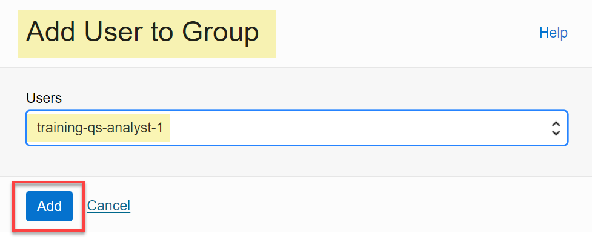

7. The **Group Details** page is re-displayed and the newly added user to this group is displayed in the **Group Members** section.

    

8. Click **Groups** in the breadcrumbs to re-display the **Groups** page. The two newly created groups are displayed in the list of available groups.

    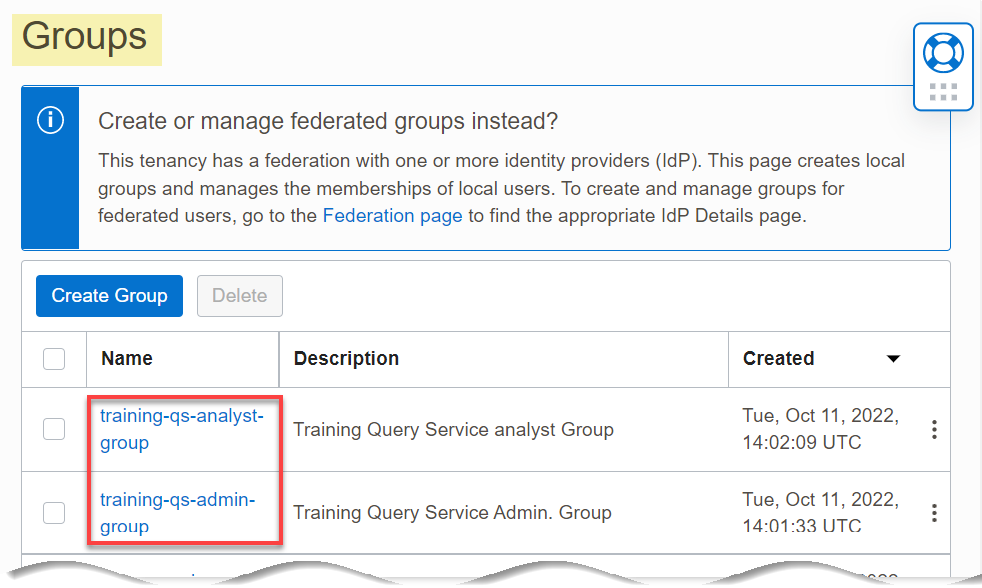

9. Click the **`training-qs-admin-group`** name link in the **Name** column to display its **Groups Details** page so that you can add the new admin user to this group.

10. On the **training-qs-admin-group** page, scroll-down to the **Group Members** section, and then click **Add User to Group**.

11. In the **Add User to Group** dialog box, click the **User** drop-down list and select the **`training-qs-admin-1`** user. Next, click **Add**. The **Group Details** page is re-displayed and the newly added user to this group is displayed in the **Group Members** section.

    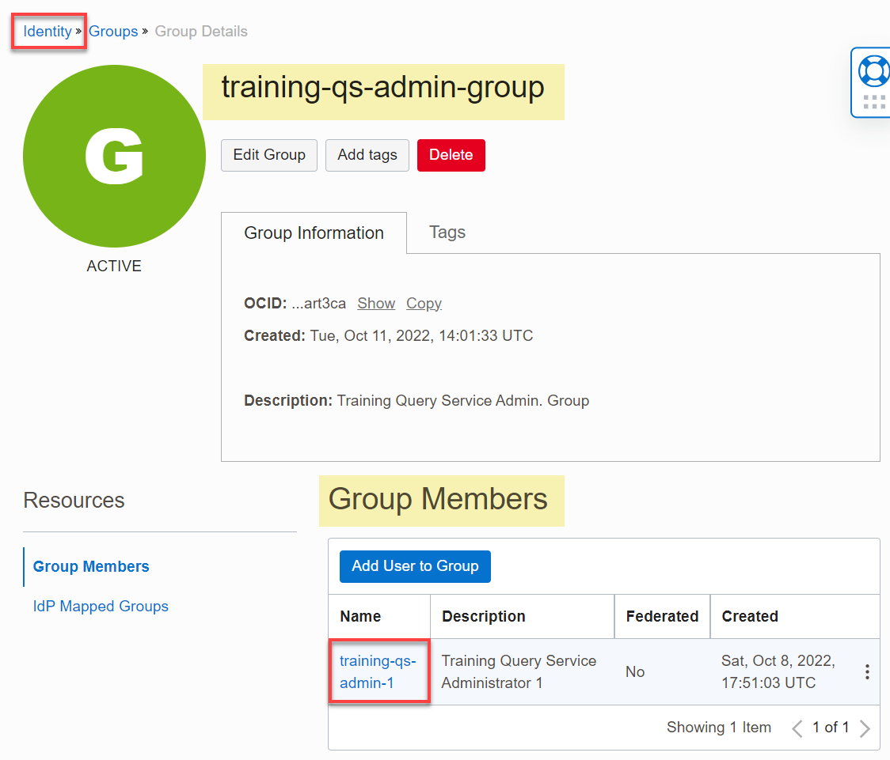

## Create IAM Policies for Controlling the Groups Access to Query Service

You create Oracle Cloud Infrastructure Identity and Access Management (IAM) policies to grant privileges to users and groups to allow them to use and/or manage Query Service resources. In this section, you will create the policies for the **`training-qs-admin-group`** and **`training-qs-analyst-group`** groups.

Before you create the two IAM policies, you will need to identify your compartment's OCID and your Query Service project's OCID. You will need both OCIDs when you create the admin and analyst policies.

### **Find the Compartment's OCID**

In the Query Service sprints, we use the **training-query-service** compartment. Both the admin and analyst policies will reference this compartment.

1. Sign in to the Oracle Cloud Infrastructure Console.

2. Open the **Navigation** menu and click **Identity & Security**. Under **Identity**, click **Compartments**.

3. On the **Compartments** page, in the row for _the compartment_, hover over the **OCID** link in the **OCID** column, and then click the **Copy** link to copy the OCID for the compartment to your clipboard.

    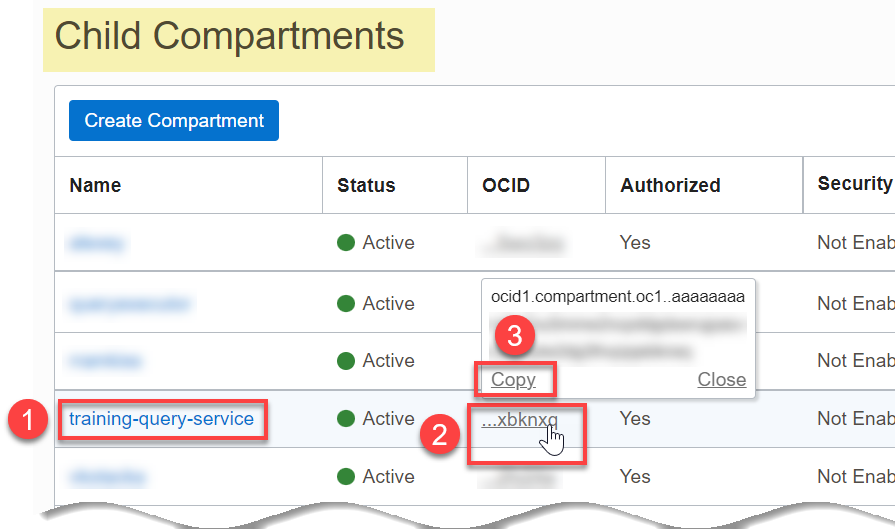

4. Paste your copied Query Service project OCID in a text editor of your choice as you will need it later in this section.

### **Find the Query Service project's OCID**

This is the project that you will reference in the analyst policy that any user in the analyst group can access and use.

1. Sign in to the Oracle Cloud Infrastructure Console, if you are not already signed in.

2. Open the **Navigation** menu and click **Analytics & AI**. Under **Data Lake**, click **Query Service**.

3. On the **Query Service Projects** page, in the row for the project to which you want to allow the analyst users to access, scroll to the right, and then click the **Actions** icon. From the context menu, click **Copy OCID** to copy it to your clipboard. In our example, we chose a Query Service project that has no association with a Data Catalog instance.

    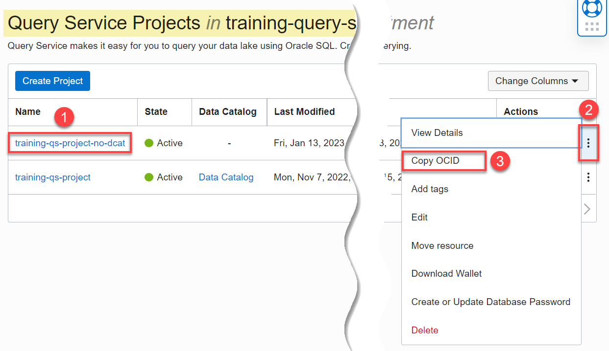

4. Paste your copied Query Service project OCID in a text editor of your choice as you will need it later in this section.

### **Create the policy for the admin users in the `training-qs-admin-group`**

Users in this group will have permissions to fully manage all the resources in Query Service such as create projects, create worksheets, create tables, and submit queries in the selected **training-query-service** compartment.

1. Click **Identity** in the breadcrumbs to re-display the **Users** page. In the **Identity** section on the left, click **Policies**.

    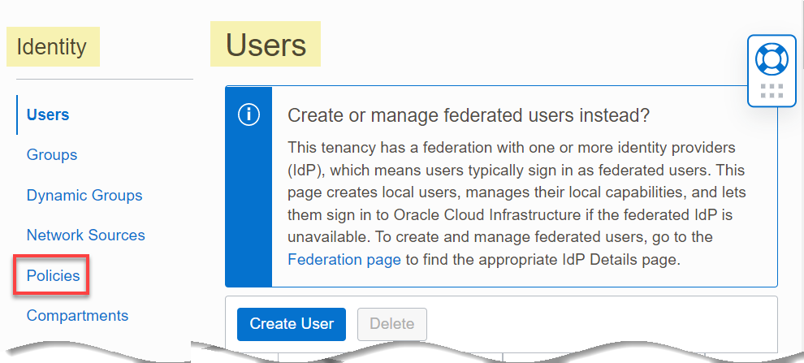

2. On the **Policies** page, if your compartment is not selected, use the **Compartment** drop-down list in the **List Scope** section to search for and select the **`training-query-service`** (or your own compartment) where the new policies will reside. To search for a compartment, type part of the compartment's name in the **Search compartments** text box. When the compartment is displayed in the list, select it.

   

3. Click **Create Policy**.

    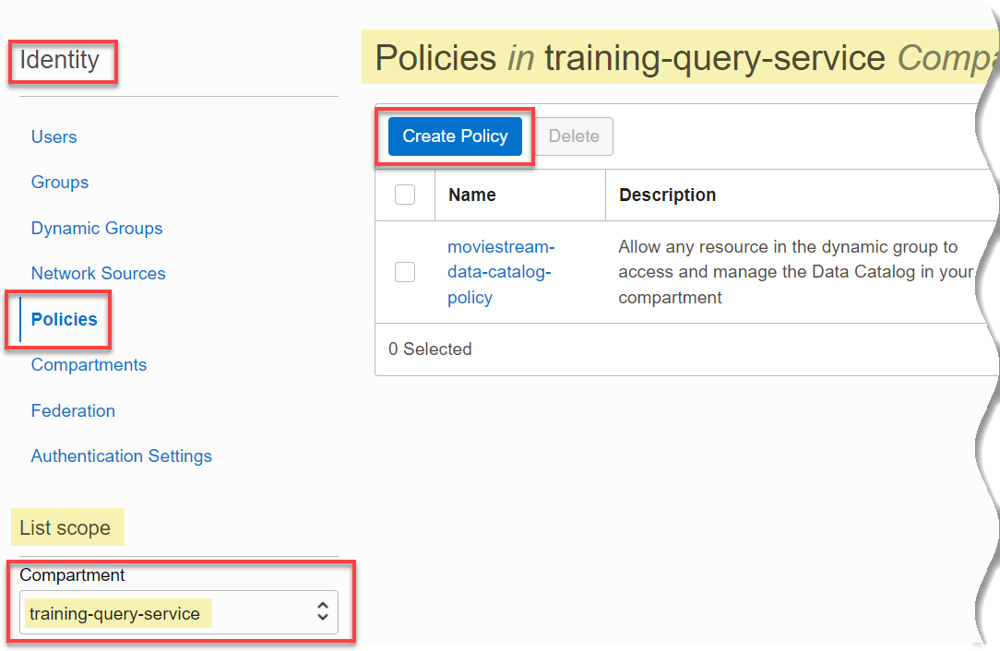

4. In the **Create Policy** dialog box, provide the following information:
    * **Name:** Enter **`qs-admin-policy`**.
    * **Description:** Enter **`Permissions for the admin users in the admin group`**.
    * **Compartment:** Select **`training-query-service`** from the **Compartment** drop-down list, if it's not already selected.
    * **Policy Builder:** Click and slide the **Show manual editor** slider to enable it. An empty text box is displayed in this section.
    * **Create Another Policy:** Select this checkbox to create the second analyst policy.
    * Click the **Copy** button in the following code box to copy the policy statement, and then paste it in the **Policy Builder** text box. This policy statement grants members of the `training-qs-admin-group` group full manage privileges on all the resources in Query Service in the current tenancy. Don't add any line breaks in any of the statements below. Replace the _'Enter your compartment ocid'_ placeholders with the ocids for your compartment that you copied earlier.

        The first policy statement allows the Query Service Administrator group to create, manage, and delete Query Service projects in the specified compartment and to run queries in those projects.

        The second policy statement allows the Query Service Administrator group to use buckets and objects in the specified compartment. This allows Query Administrators to use a Query Service project to browse object storage files, preview and analyze object storage file contents, and create tables based on object storage files.

        **Note:** Don't remove the tickmarks (' ').

        ```
        <copy>Allow group training-qs-admin-group to manage query-service-projects in compartment id 'Enter your compartment ocid'
        Allow group training-qs-admin-group to use object-family in compartment id 'Enter your compartment ocid'</copy>
        ```

        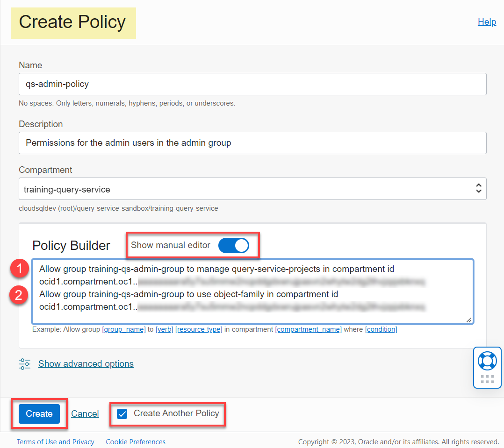

5. Click **Create**. A confirmation message is displayed. You can click the **View Details** link to display the **Policy Detail** page in a new tab in your browser. The **Create Policy** dialog box is re-displayed.

    **Create the policy for the analyst users in the `training-qs-analyst-group`**

    Users in this group will have specific permissions to the resources that are available in Query Service. Create a policy that grant members of the `training-qs-analyst-group` group the following permissions to Query Service resources in the **`training-query-service`** compartment:

    * Use the specified project and the tables and worksheets in the project.
    * Create, update, and delete a worksheet in the specified project.
    * Run queries in the specified project.

6. Provide the following information for the analyst group policy:

    * **Name:** Enter **`qs-analyst-policy`**.
    * **Description:** Enter **`Permissions for the analyst users in the analyst group`**.
    * **Compartment:** Select **`training-query-service`** from the **Compartment** drop-down list, if it's not already selected.
    * **Policy Builder:** Click and slide the **Show manual editor** slider to enable it. An empty text box is displayed in this section.
    * **Create Another Policy:** De-select this checkbox.
    * Click the **Copy** button in the following code box to copy the policy statements, and then paste them in the **Policy Builder** text box. Don't add any line breaks in any of the statements below. Replace the _'Enter your compartment ocid'_ and _'Enter your Query Service project ocid'_ placeholders with the OCIDs for your compartment and query service project that you copied earlier.

        The first policy statement allows the Query Service Analyst group to list all projects in the specified compartment.

        The next three policy statements allow the Query Service Analyst group to read the specified project and to use tables, schemas, and worksheets in that project.

        The fifth policy statement allows the Query Service Analyst group to run queries.

        The final policy statement allows the Query Service Analyst group to use buckets and objects in the specified compartment. This allows Query Analysts to use the Query Service project to browse object storage files, preview and analyze object storage file contents, and to create tables based on the object storage files.

        **Note:** Don't remove the tickmarks (' ').

        ```
        <copy>
        Allow group training-qs-analyst-group to inspect query-service-projects in compartment id 'Enter your compartment ocid'
        Allow group training-qs-analyst-group to read query-service-projects in compartment id 'Enter your compartment ocid' where target.resource.id = 'Enter your Query Service project ocid'
        Allow group training-qs-analyst-group to read query-service-projects in compartment id 'Enter your compartment ocid' where any {target.resource.kind = 'query-service-schemas',target.resource.kind = 'query-service-tables'}
        Allow group training-qs-analyst-group to manage query-service-projects in compartment id 'Enter your compartment ocid' where target.resource.kind = 'query-service-worksheets'
        Allow group training-qs-analyst-group to use query-service-executions in compartment id 'Enter your compartment ocid'
        Allow group training-qs-analyst-group to use object-family in compartment id 'Enter your compartment ocid'
        </copy>
        ```

        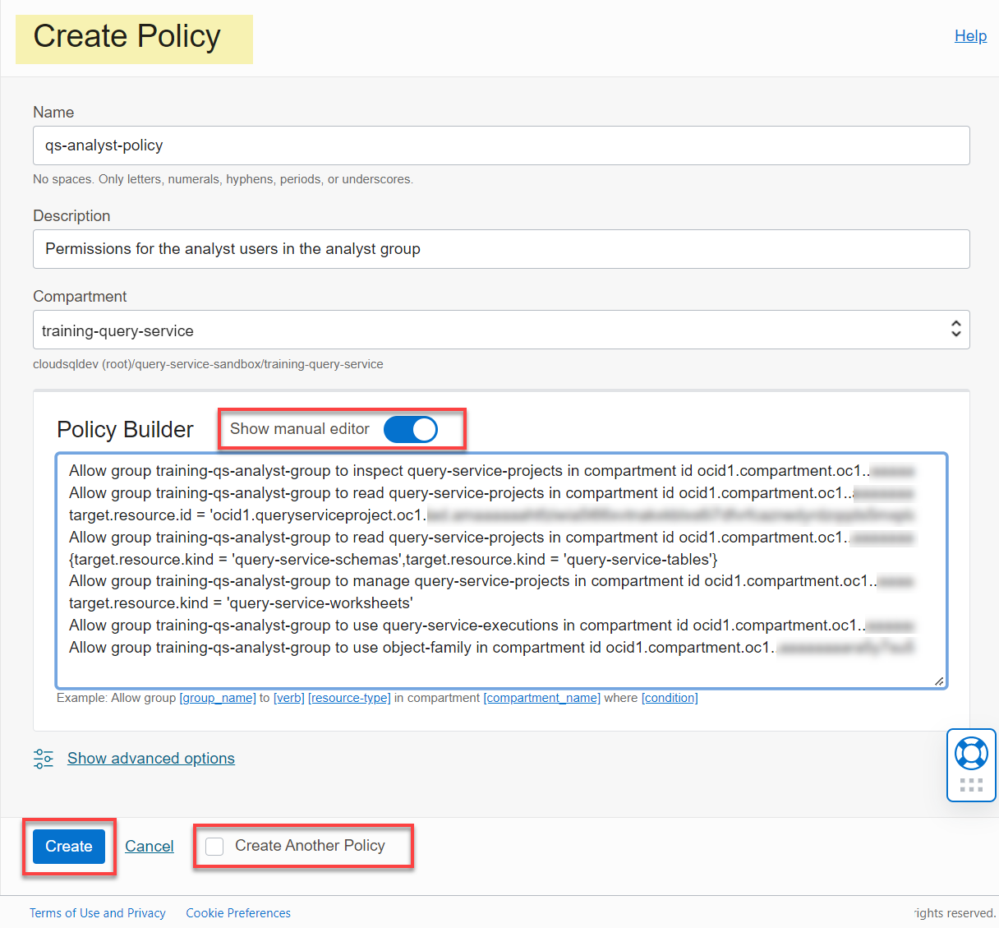

7. Click **Create**. The **qs-analyst-policy** **Policy Detail** page is displayed. The policy statements are displayed in the **Statements** section. Click the **Policies** link in the breadcrumbs to return to the **Policies** page. The two new policies are displayed.

    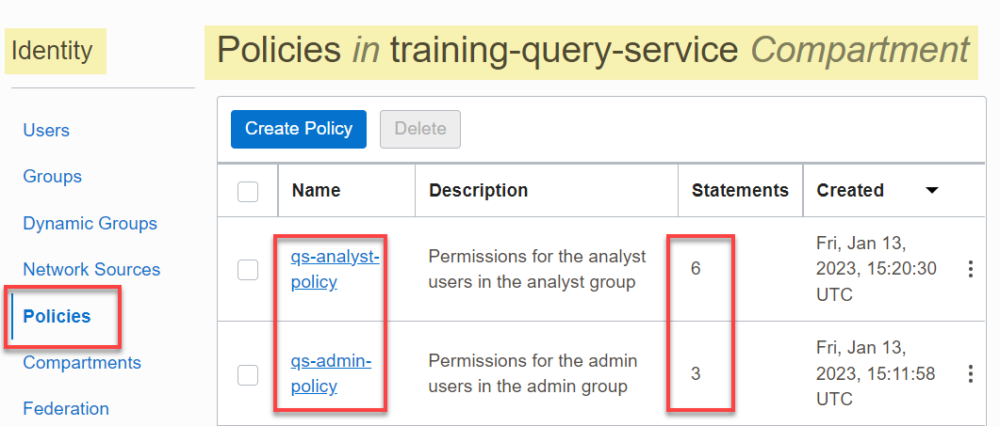

## Test the Admin and Analyst Users Permissions

**Test accessing Query Service as the new admin user and create a new project.**

1. Sign in to the **Console** as the newly created `training-qs-admin-1` IAM user. Enter your tenancy name in the **Cloud Account Name** field, and then click **Next**. On the **Sign In** page, click the down arrow next to the **Oracle Cloud Infrastructure Direct Sign-In** section to expand it. Enter the admin username and password, and then click **Sign In**.

    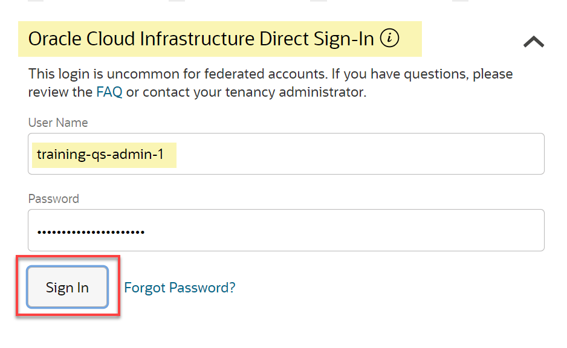

2. On the **Console** Home page, open the **Navigation** menu and click **Analytics & AI**. Under **Data Lake**, click **Query Service**. The **Query Service Overview** page is displayed. Click **Go to projects**. The **Query Service Projects** page is displayed. The admin user has full access to all the Query Service projects in the compartment specified in the **`qs-admin-policy`** policy. The admin user can also create new projects, query tables in the selected schemas, save queries in worksheets, inspect schemas, among other things.

    

3. Create a new project. Click **Create Project**. Accept the default name and compartment, enter an optional description. Make sure to keep the **Associate Data Catalog Instance** checkbox de-selected (default) and don't use the **Create Dynamic Group and Access Policies** section.

    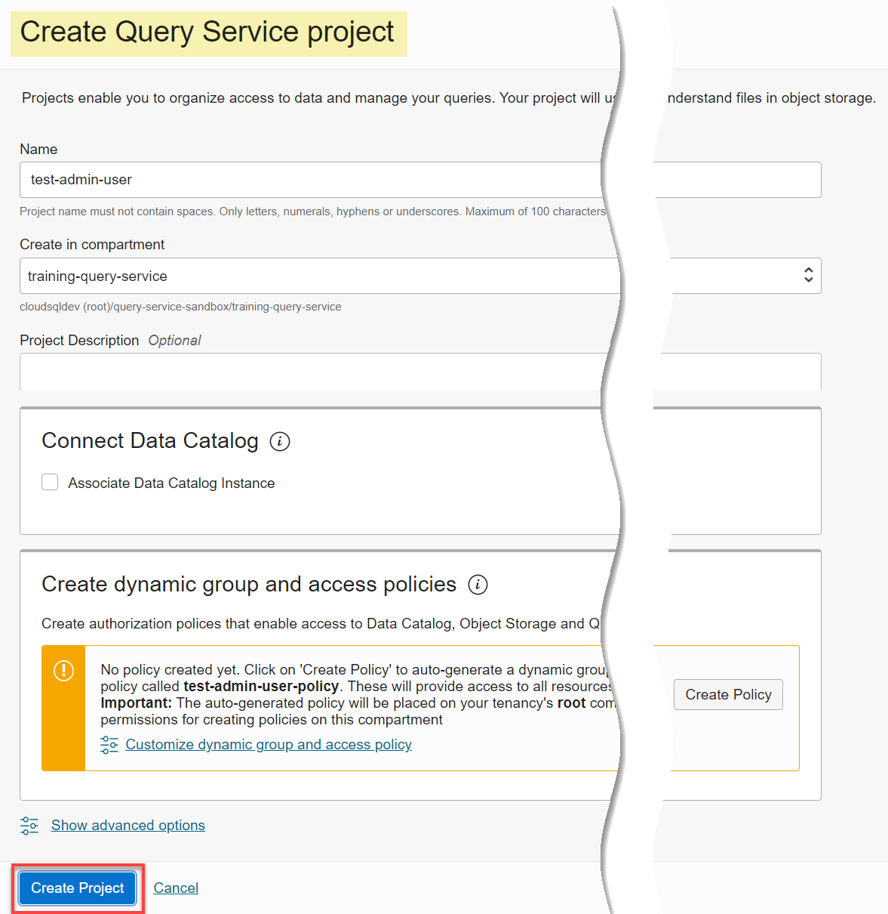

4. The **Query Service Projects** page is re-displayed. You can use the **State** drop-down list to select the **Any state** or the **Creating** states to view the project while it's being created. If the project is successfully created, it is displayed on the page and its state changes to **Active**.

    

    >**Note:** For detailed information on how to create a new project, see the **How do I create a Query Service project?** sprint from the **Contents** menu on the left.

5. As the new admin user, you can inspect the available **MOVIESTREAM_DEMO**, **PROJECT**, and **PROJECT$** schemas and query any table in those schemas. You can also save the queries to new worksheets.

6. Logout of the admin account. From the **Profile** icon in the banner, click **Sign out**. Don't close the web browser window because you will still use it to test logging in to the analyst user in the next step.

### **Test accessing Query Service as the new analyst user and attempt to create a new project and query some data.**

7. Sign in to the **Console** as the newly created `training-qs-analyst-1` IAM user. Enter your tenancy name in the **Cloud Account Name** field, and then click **Next**. On the **Sign In** page, click the down arrow next to the **Oracle Cloud Infrastructure Direct Sign-In** section to expand it. Enter the analyst username and password, and then click **Sign In**.

8. On the **Console** Home page, open the **Navigation** menu and click **Analytics & AI**. Under **Data Lake**, click **Query Service**. The **Query Service Overview** page is displayed. Click **Go to projects**. The **Query Service Projects** page is displayed.

9. In our example, the analyst user can _list_ (view) all of the Query Service projects in the **`training-query-service`** compartment that specified in the **`qs-analyst-policy`** policy; however, this user can only _use_ the project that was specified in the policy, **training-qs-project-no-dcat**.

    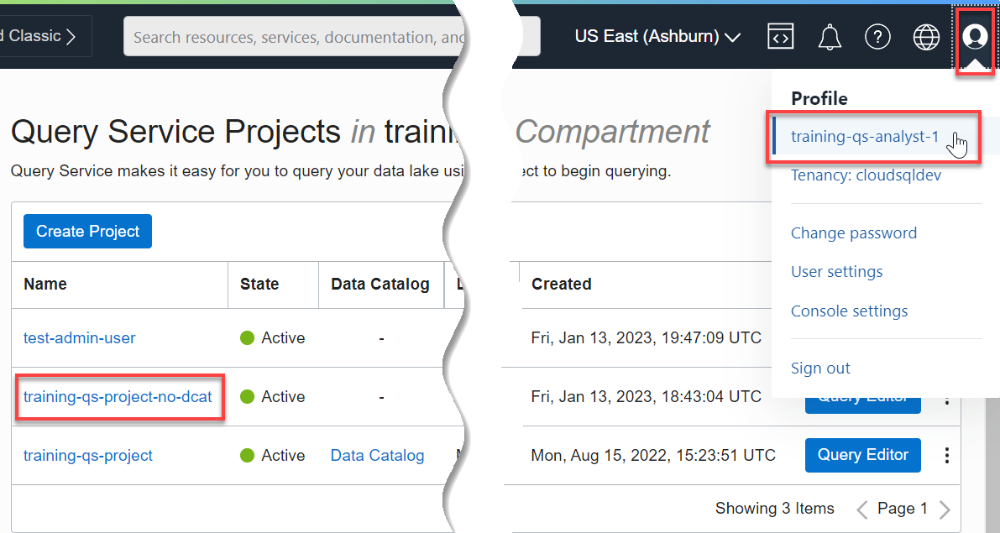

10. Click the **training-qs-project-no-dcat** project to display its details.

    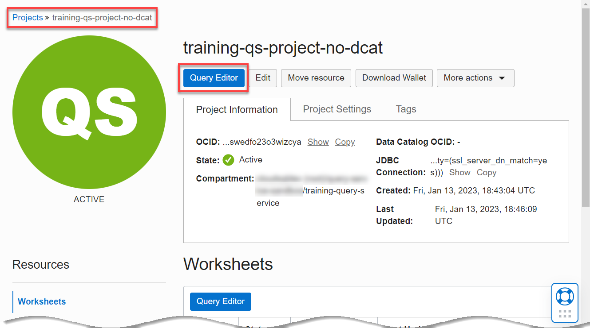

11. Click **Query Editor**. This user can see the available schemas in this project. Experiment with inspecting the available schemas and the tables in the schemas as desired. The user can also query any table in the available schemas and save the queries to new worksheets. In this example, the analyst user queried the **CUSTSALES** table in the **MOVIESTREAM_DEMO** sample schema.

    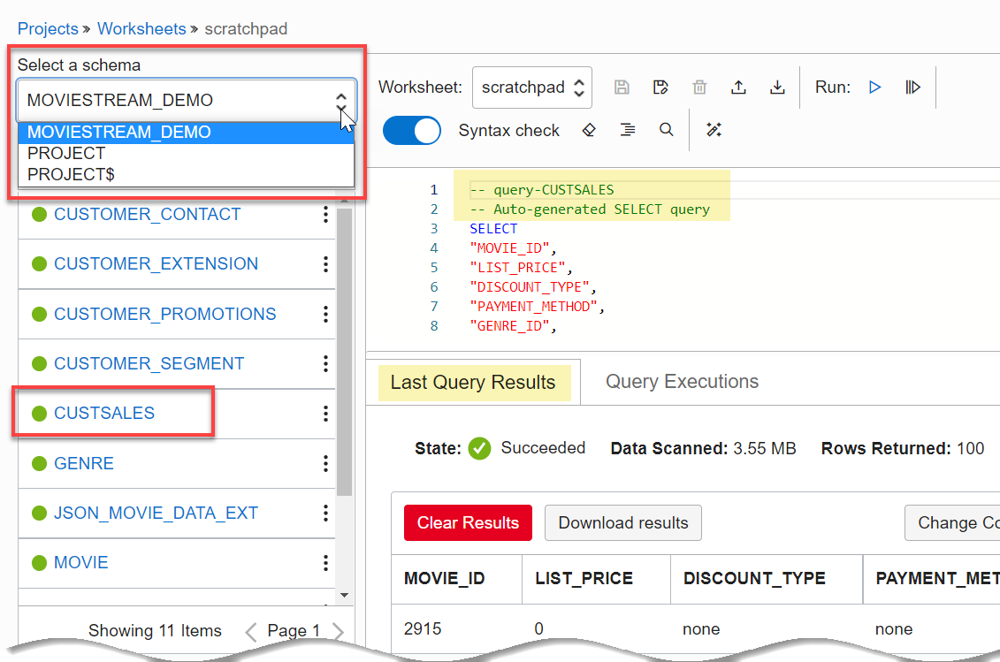

12. Click the **Projects** link in the breadcrumbs to return to the **Query Service Projects** page.

13. Attempt to click on any other project to display their details. An error message is displayed indicating that authorization failed or the requested resource cannot be found. Again, the analyst user can only access the project specified in the policy.

    

14. Click your browser's Back button to return to the **Query Service Projects** page.

15. Attempt to create a new Query Service project. Accept the default name and compartment. Make sure that the **Associate Data Catalog Instance** checkbox id de-selected. Next, click **Create Policy**. An error message is displayed since the analyst user is not allowed to create new projects. _This user can only use (not create) the project that was specified in the **`qs-analyst-policy`** policy._

    

## Learn More

* [Signing In to the Console](https://docs.cloud.oracle.com/en-us/iaas/Content/GSG/Tasks/signingin.htm)
* [Oracle Cloud Infrastructure Documentation](https://docs.oracle.com/en-us/iaas/Content/GSG/Concepts/baremetalintro.htm)

## Acknowledgements

* **Author:** Lauran Serhal, Consulting User Assistance Developer
* **Contributors:**
    * Petr Blaha, Senior Software Development Manager
    * Vít Kotačka, Software Developer
    + Ravi Ramkissoon, Software Development Director
* **Last Updated By/Date:** Lauran Serhal, January 2023
